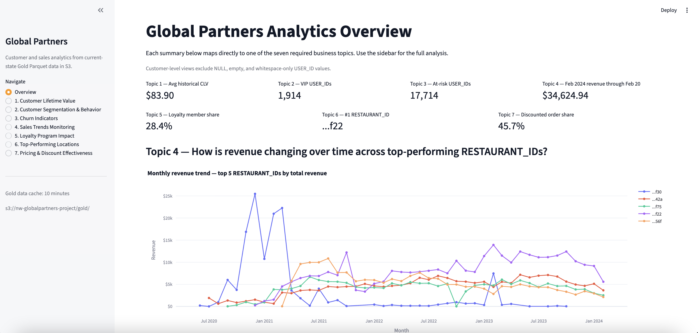
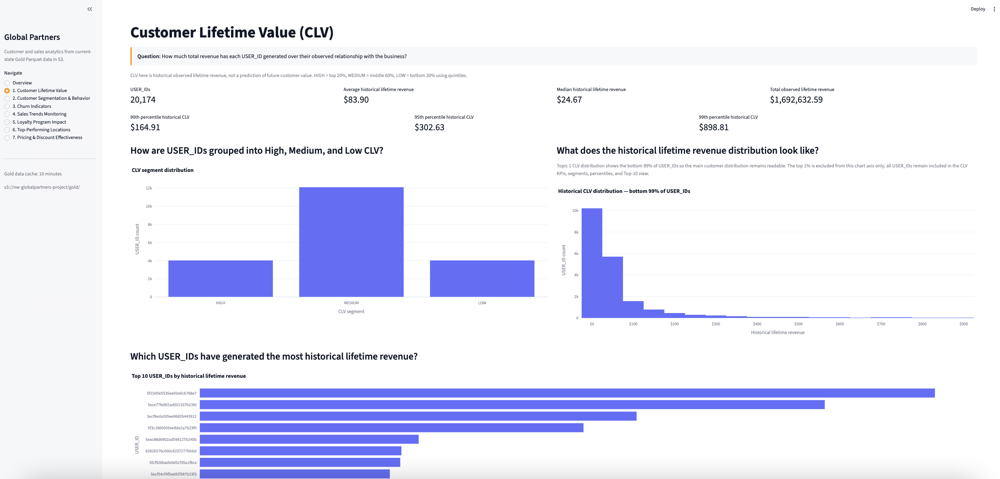
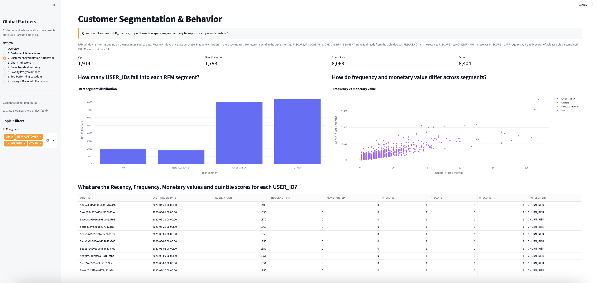
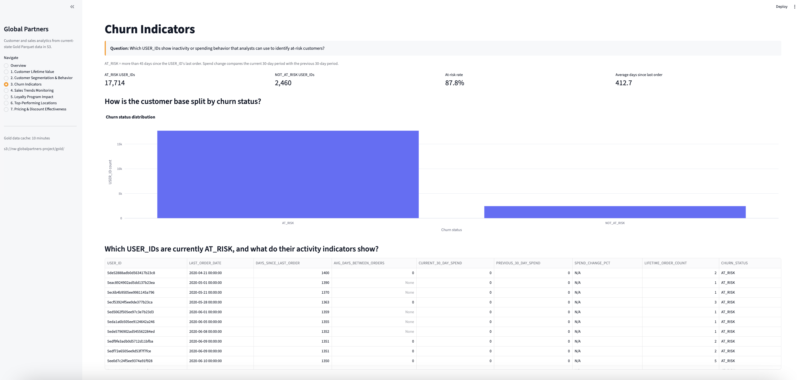
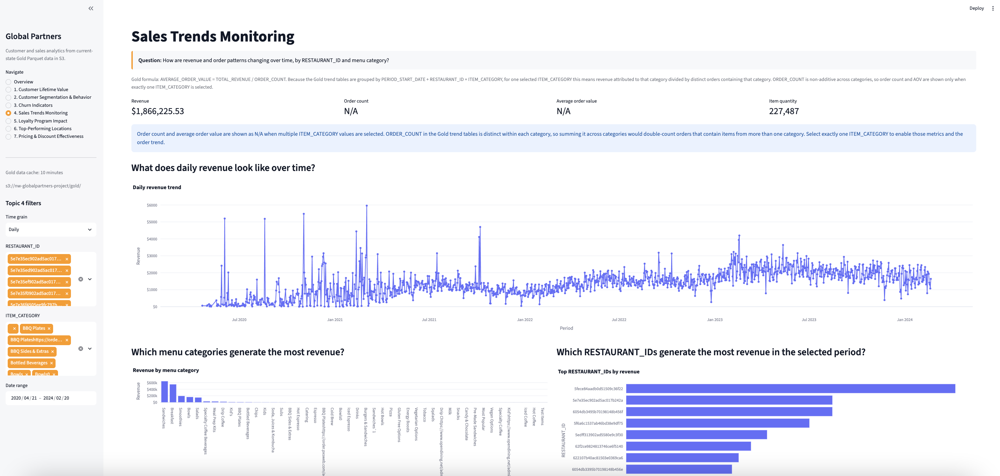
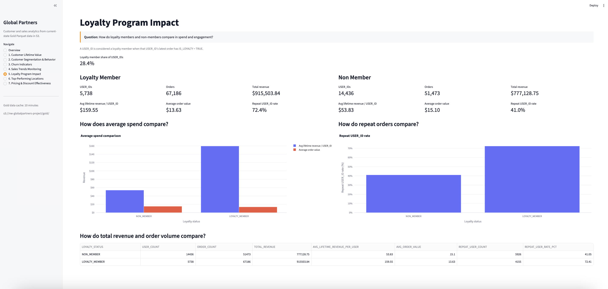
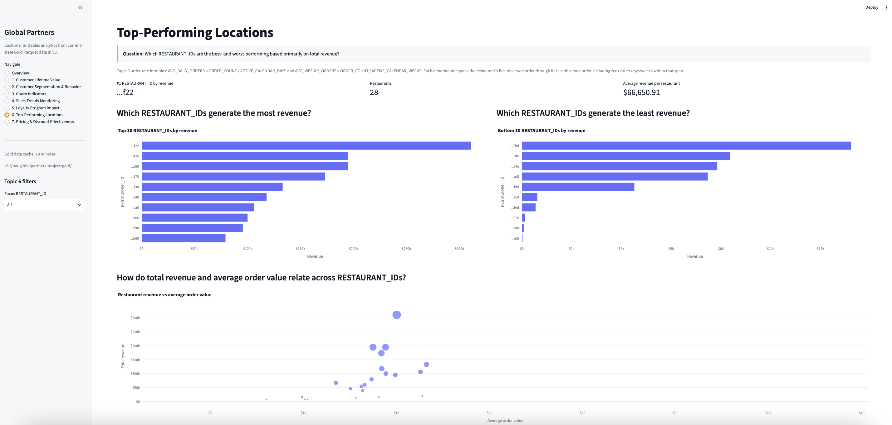
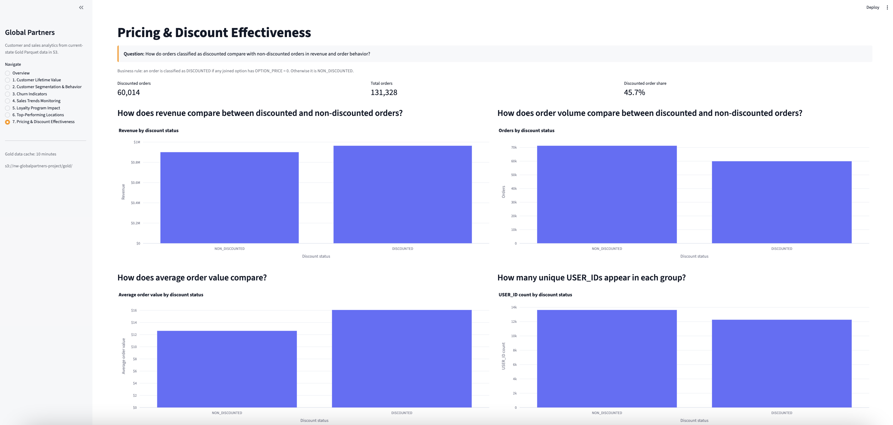

# Global Partners Streamlit Analytics

A Streamlit dashboard that reads current-state Gold Parquet datasets directly from Amazon S3 and presents an Overview page plus seven customer and sales analytics topics.

## Overview and topics

1. Customer Lifetime Value — historical observed lifetime revenue and High / Medium / Low CLV bands.
2. Customer Segmentation & Behavior — six-month RFM metrics, quintile scores, and VIP / New Customer / Churn Risk segments.
3. Churn Indicators — days since last order, average order gap, 30-day spend change, and the `>45 days` at-risk rule.
4. Sales Trends Monitoring — separate daily, weekly, and monthly Gold tables with `RESTAURANT_ID` and `ITEM_CATEGORY` filters.
5. Loyalty Program Impact — loyalty members vs non-members using the latest-order loyalty status.
6. Top-Performing Locations — revenue ranking plus order, USER_ID, average order value, daily order, weekly order, and revenue-per-user metrics.
7. Pricing & Discount Effectiveness — discounted vs non-discounted revenue and order behavior, where any joined `OPTION_PRICE = 0` classifies the order as discounted.

The app also includes a landing Overview page summarizing the seven topics with a few high-level KPIs.

## Screenshots

### Overview



### 1. Customer Lifetime Value



### 2. Customer Segmentation & Behavior



### 3. Churn Indicators



### 4. Sales Trends Monitoring



### 5. Loyalty Program Impact



### 6. Top-Performing Locations



### 7. Pricing & Discount Effectiveness



## Data source

The app reads from:

```text
s3://nw-globalpartners-project/gold/
```

Expected Gold prefixes:

```text
customer_clv/
customer_rfm/
churn_indicators/
sales_trends_daily/
sales_trends_weekly/
sales_trends_monthly/
loyalty_program_impact/
restaurant_performance/
discount_effectiveness/
```

Each dataset is loaded from its matching prefix under `gold/` and cached in Streamlit for 10 minutes.

## Local setup

Create and activate a Python environment, then install the project dependencies:

```bash
pip install -r requirements.txt
```

If your normal AWS CLI credential chain is already configured locally, the app can use those credentials automatically with no extra secrets file required.

Run the dashboard from the project root:

```bash
streamlit run deployment/app.py
```

If you are already in the `deployment/` directory, this also works:

```bash
streamlit run app.py
```

## Notes

- `USER_ID` is used throughout for customer-level analytics.
- `RESTAURANT_ID` is used throughout for restaurant/location analytics.
- Historical CLV is descriptive, not predictive.
- Rows with NULL, empty, or whitespace-only `USER_ID` values are excluded from customer-level analysis.
- The app expects the actual file to live in `deployment/app.py`, not at the repo root.
